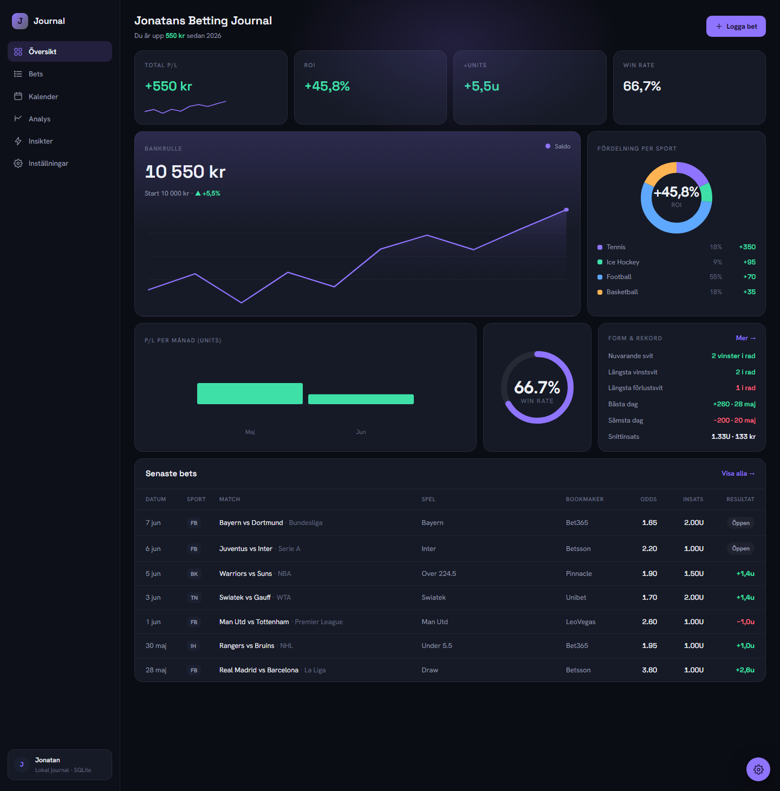
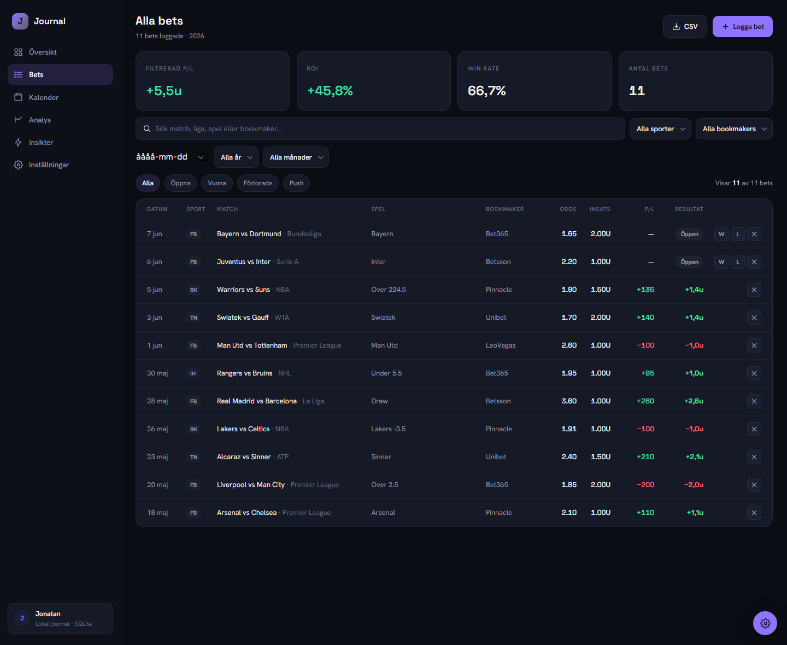
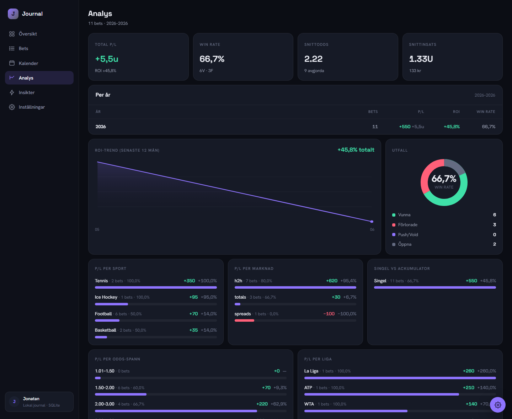

# 🎯 Betting Journal

> A local-first sports betting journal. Log bets in **units**, track **ROI** and
> **bankroll** over time, and **auto-settle** results from a bet365 account statement
> or The Odds API — all on your machine, no account, no cloud.

<p align="left">
  
  
  
  
  
  
</p>

<p align="center">
  
</p>

---

## ✨ Features

- **Unit-based staking** with decimal (European) odds — `1U`, `1.25U`, `2.6U` …
  Unit value in your currency is configurable in Settings.
- **Dashboard** with bankroll-over-time curve, total P/L, ROI, win rate, sport
  distribution, monthly P/L bars and form/streak records.
- **Bet log** — add, edit, delete and quick-settle bets (Win / Loss / Push / Void),
  with CSV export.
- **Analytics** — profit & loss broken down by market, league, sport and odds band.
- **Insights & calendar** — streaks, best/worst days, average stake, and a calendar
  heatmap of results.
- **Auto-settling, two ways:**
  - Import a **bet365 account-statement PDF** — parses every slip and settles from the
    *actual payout* (after tax), never recomputed.
  - Optional **[The Odds API](https://the-odds-api.com/)** integration to grade finished
    events and pull closing odds for CLV.
- **Local & private** — everything lives in a single SQLite file. No login, no server,
  no third party sees your bets.

## 🖼️ Screenshots

| Bet log | Analytics |
|---------|-----------|
|  |  |

## 🛠️ Tech stack

**Next.js 14** (App Router) · **TypeScript** · **Prisma + SQLite** · **Tailwind CSS** ·
**Recharts** · **Vitest** · **pdfjs-dist** (statement parsing).

## 🚀 Quick start

> Requires **Node.js 18.18+**.

```bash
npm install        # install dependencies (once)
npm run db:push    # create the SQLite database
npm run db:seed    # (optional) load demo bets so the dashboard isn't empty
npm run dev        # start the dev server
```

Open **http://localhost:3000**.

`db:seed` inserts a handful of **fictional demo bets** so you can explore the app
immediately — replace them with your own from the **Logga bet** button.

## 📜 Scripts

| Command | What it does |
|---------|--------------|
| `npm run dev` | Start the development server |
| `npm run build` / `npm start` | Production build / run it |
| `npm test` | Run the unit tests (Vitest) |
| `npm run db:push` | Create / sync the SQLite schema |
| `npm run db:seed` | Insert demo bets |
| `npm run db:studio` | Browse the database in Prisma Studio |
| `npm run sync` | Auto-settle finished bets + fetch closing odds (needs API key) |
| `npm run import:bet365` | Import / sync bets from a bet365 statement PDF |
| `npm run import:unibet` | Import bets from a Unibet transaction-history CSV |

## 🗂️ Pages

| Page | What |
|------|------|
| **Översikt** (Overview) | ROI, total P/L, win rate, bankroll curve, breakdowns |
| **Bets** | Full bet log — quick-settle, edit, delete, CSV export |
| **Kalender** (Calendar) | Calendar heatmap of daily results |
| **Analys** (Analytics) | P/L by market, league, sport and odds band |
| **Insikter** (Insights) | Streaks, best/worst days, averages |
| **Inställningar** (Settings) | Unit value, currency, starting bankroll, sync |

> The UI is in **Swedish** 🇸🇪 — it's a personal journal — but the codebase and docs
> are in English.

## 🔄 Auto-settling

### From a bet365 statement (no API needed)

Export your **account statement** as PDF, drop it in the project root as `statement.pdf`
(or point `BET365_PDF` at it), then:

```bash
npm run import:bet365              # dry-run: parse + print stats, DB untouched
npm run import:bet365 -- --confirm # incremental: settle pending + add new slips
```

It matches on each slip's reference, so it never wipes manually-added bets and is safe
to re-run. Profit comes from the **actual payout column**, after tax. Statement files
are git-ignored — they never leave your machine.

### From The Odds API (grading + CLV)

1. Get a free key (~500 requests/month) at <https://the-odds-api.com/>.
2. Copy `.env.local.example` → `.env.local` and set `ODDS_API_KEY=your_key`.
3. Restart the dev server. Then **Synka** (or `npm run sync`) settles finished H2H /
   totals / spreads bets and stores closing odds for CLV.

| Market | Auto-settled? |
|--------|---------------|
| H2H / Moneyline (incl. draw) | ✅ |
| Totals (Over/Under) | ✅ (exact line = push) |
| Spread / Handicap | ✅ (whole lines can push) |
| Other (BTTS, props, …) | ✍️ Settle manually |

## 🧪 Testing

```bash
npm test
```

Covers profit/ROI/CLV math and auto-grading (win/loss/push/half/void, draws,
totals-push, spread half-lines), plus insights and score parsing.

## 📁 Project structure

```
app/            Pages + API routes (App Router)
components/     UI components and charts
lib/            betting.ts (math) · grading.ts (auto-settle) · bet365.ts (PDF parse)
                oddsApi.ts · sync.ts · insights.ts
prisma/         schema.prisma + seed.ts (demo data)
scripts/        sync.ts · importBet365.ts (CLI tools)
tests/          Unit tests for the math and grading
```

## ⚠️ Disclaimer

This is a personal record-keeping tool, **not** betting advice and **not** a guarantee of
profit. Gamble responsibly, only with money you can afford to lose. If betting stops being
fun, seek help (in Sweden: [Stödlinjen](https://www.stodlinjen.se/), 020-81 91 00).

## 📄 License

[MIT](LICENSE) © Jonatan

---

<details>
<summary>🇸🇪 <strong>Svenska</strong> — klicka för svensk beskrivning</summary>

<br>

## 🎯 Betting Journal

En **lokal** betting-journal. Logga bets i **units** med decimalodds, följ **ROI** och
**bankrulle** över tid, och **auto-rätta** resultat från ett bet365-kontoutdrag eller
The Odds API — allt på din egen dator, ingen inloggning, ingen molntjänst.

### ✨ Funktioner

- **Unit-staking** med decimalodds (`1U`, `1.25U`, `2.6U` …). Enhetsvärde i valuta
  sätts i Inställningar.
- **Översikt** med bankrulle-graf, total P/L, ROI, win rate, fördelning per sport,
  P/L per månad och form/svit-rekord.
- **Bet-logg** — lägg till, redigera, ta bort och snabb-rätta (Vinst/Förlust/Push/Void)
  med CSV-export.
- **Analys** — P/L per marknad, liga, sport och odds-band.
- **Insikter & kalender** — svit, bästa/sämsta dag, snittinsats och kalender-heatmap.
- **Auto-rättning på två sätt:** importera ett **bet365-kontoutdrag (PDF)** — vinst tas
  från den *faktiska utbetalningen* efter skatt — eller koppla på
  **[The Odds API](https://the-odds-api.com/)** för rättning + stängningsodds (CLV).
- **Lokalt & privat** — allt i en SQLite-fil. Ingen ser dina bets.

### 🚀 Snabbstart

> Kräver **Node.js 18.18+**.

```bash
npm install        # installera beroenden (en gång)
npm run db:push    # skapa SQLite-databasen
npm run db:seed    # (valfritt) lägg in demo-bets
npm run dev        # starta på http://localhost:3000
```

`db:seed` lägger in **påhittade demo-bets** så appen inte är tom — byt ut mot dina egna
via **Logga bet**.

### 🔄 Auto-rättning från bet365

Exportera ditt **kontoutdrag** som PDF, lägg det i projektroten som `statement.pdf`
(eller peka `BET365_PDF` på det):

```bash
npm run import:bet365              # dry-run: parsar + skriver statistik
npm run import:bet365 -- --confirm # inkrementellt: rättar pending + lägger till nya
```

Matchar på varje slips referens — rör aldrig manuellt tillagda bets och är säker att
köra om. Kontoutdrag är git-ignorerade och lämnar aldrig din dator.

### 🔄 Auto-rättning via The Odds API

1. Skaffa en gratis nyckel på <https://the-odds-api.com/> (~500 anrop/mån).
2. Kopiera `.env.local.example` → `.env.local` och sätt `ODDS_API_KEY=din_nyckel`.
3. Starta om. **Synka** (eller `npm run sync`) rättar färdigspelade bets och hämtar
   stängningsodds.

### ⚠️ Friskrivning

Detta är ett verktyg för att föra bok över egna bets — **inte** spelråd och **ingen**
garanti för vinst. Spela ansvarsfullt, bara för pengar du har råd att förlora. Om spelandet
slutar vara kul: [Stödlinjen](https://www.stodlinjen.se/), 020-81 91 00.

</details>
